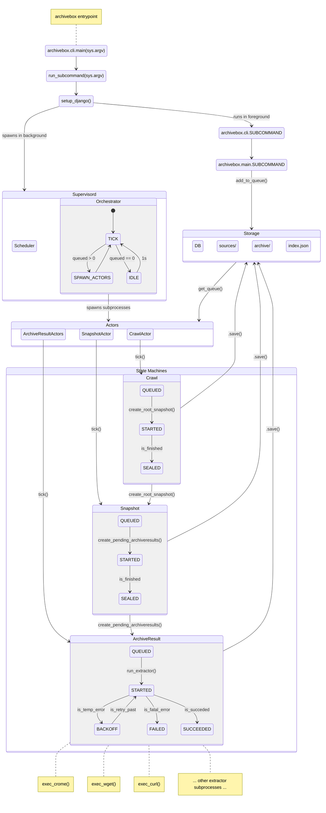
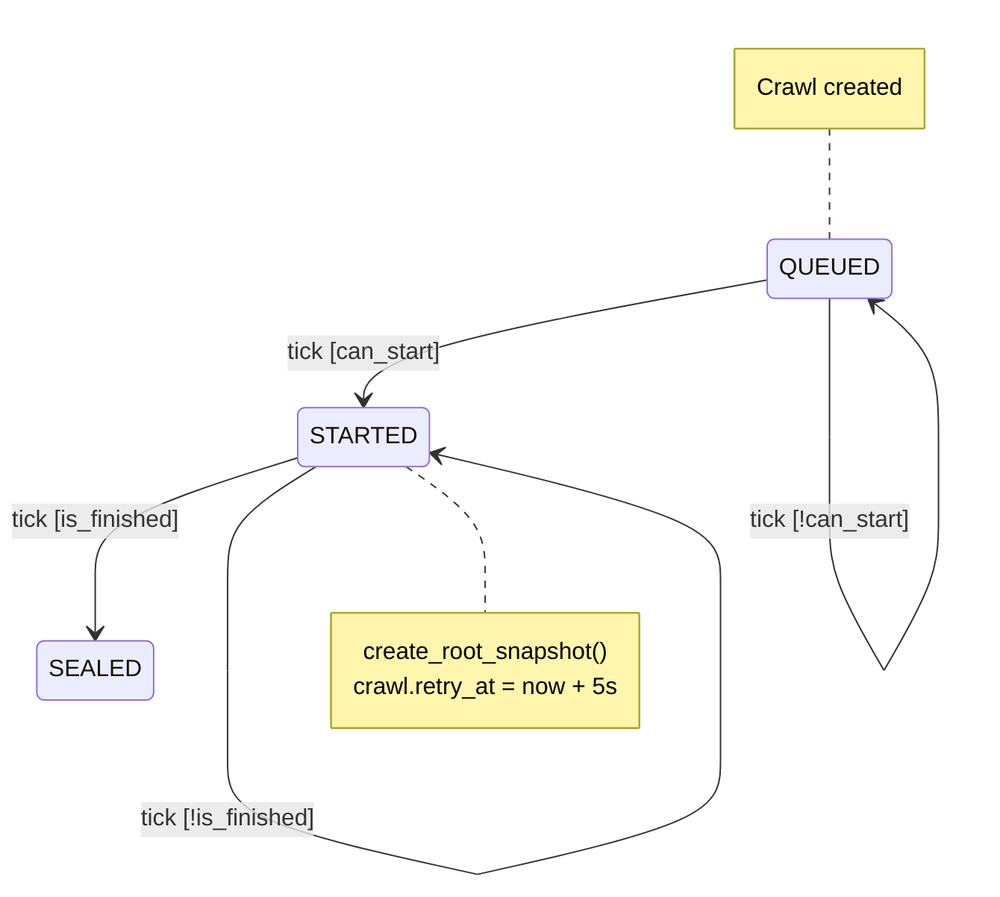
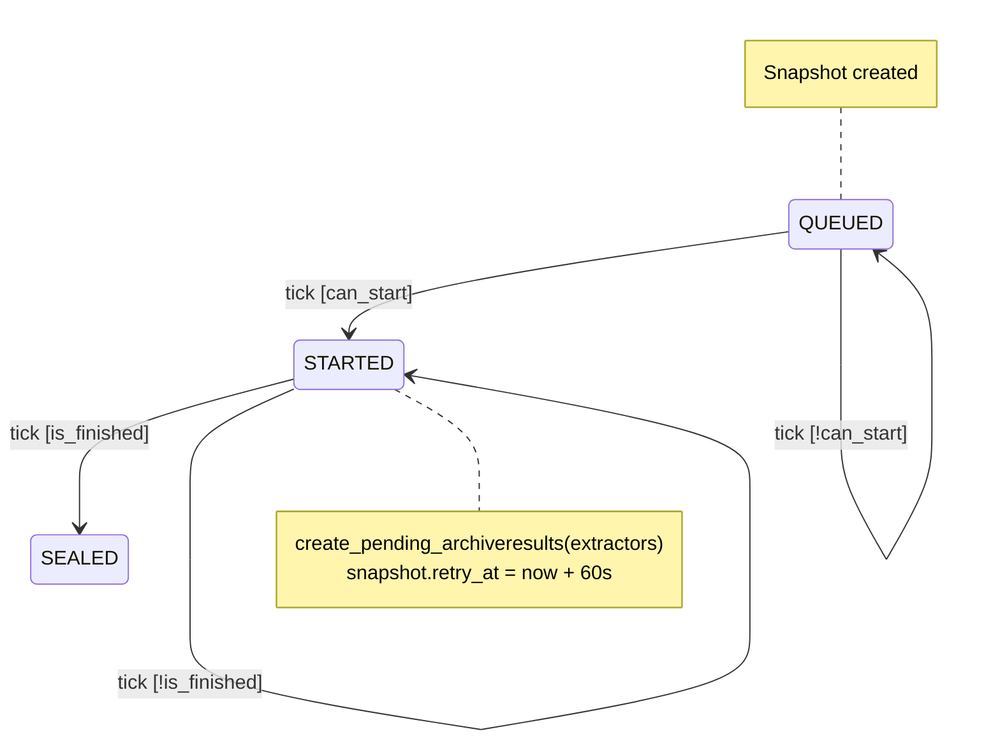
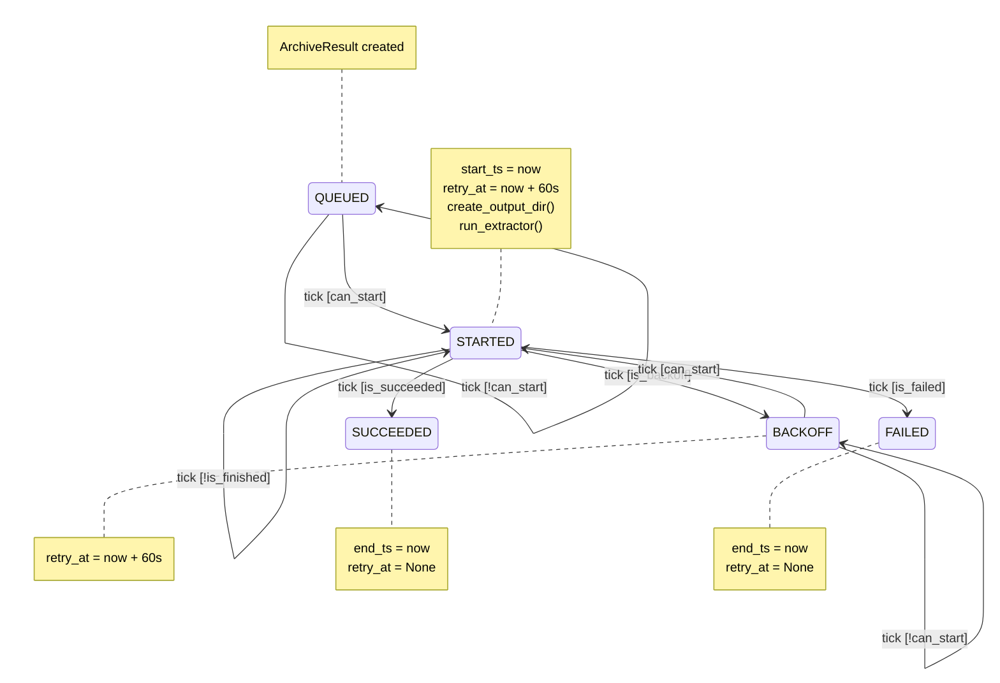

# ArchiveBox Architecture Diagrams

## High-Level System Execution Flow

---

## State Diagrams for Main Models

### `Crawl`

- `crawls/models.py`: `Crawl`
- `crawls/statemachines.py`: `CrawlMachine`

## `Snapshot`

- `core/models.py`: `Snapshot`
- `core/statemachines.py`: `SnapshotMachine`

### `ArchiveResult`

- `core/models.py`: `ArchiveResult`
- `core/statemachines.py`: `ArchiveResultMachine`

