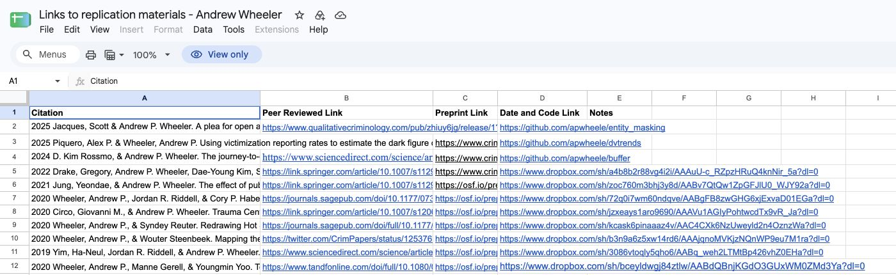
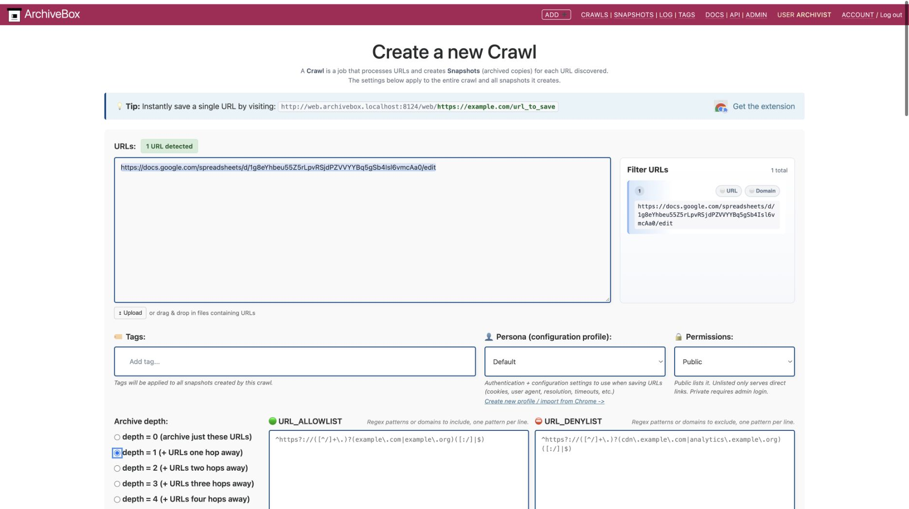
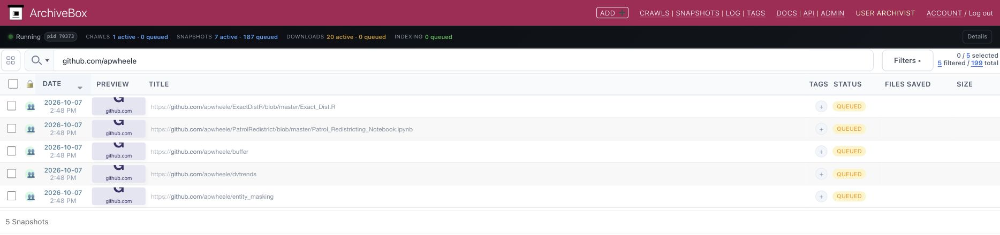
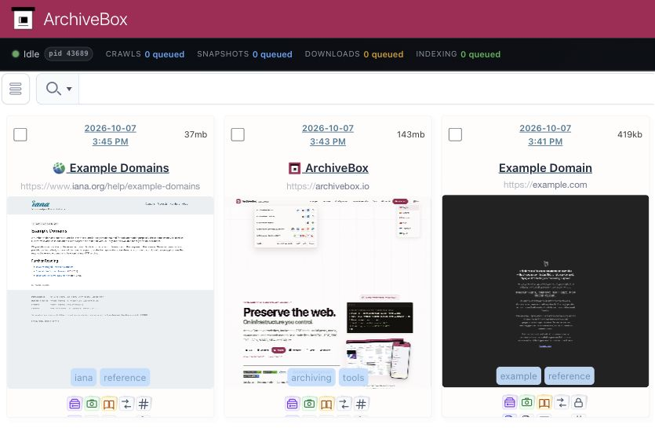
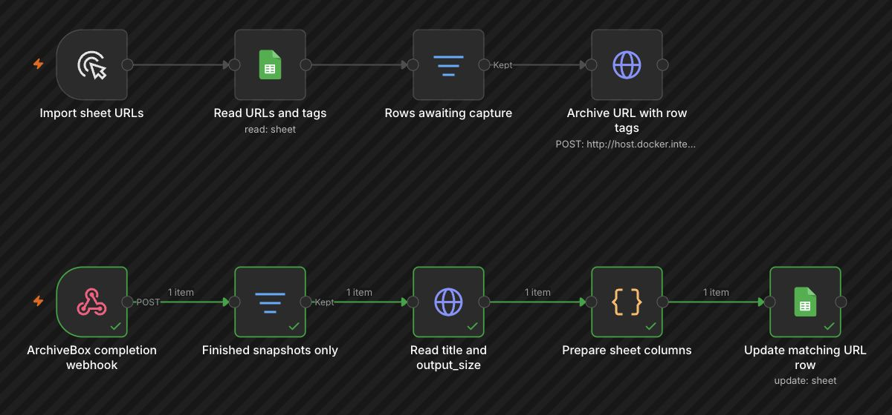
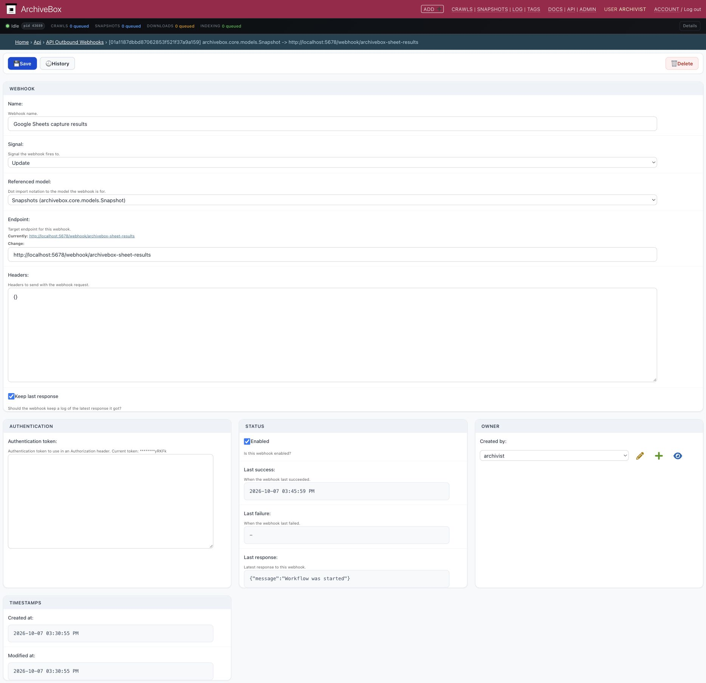
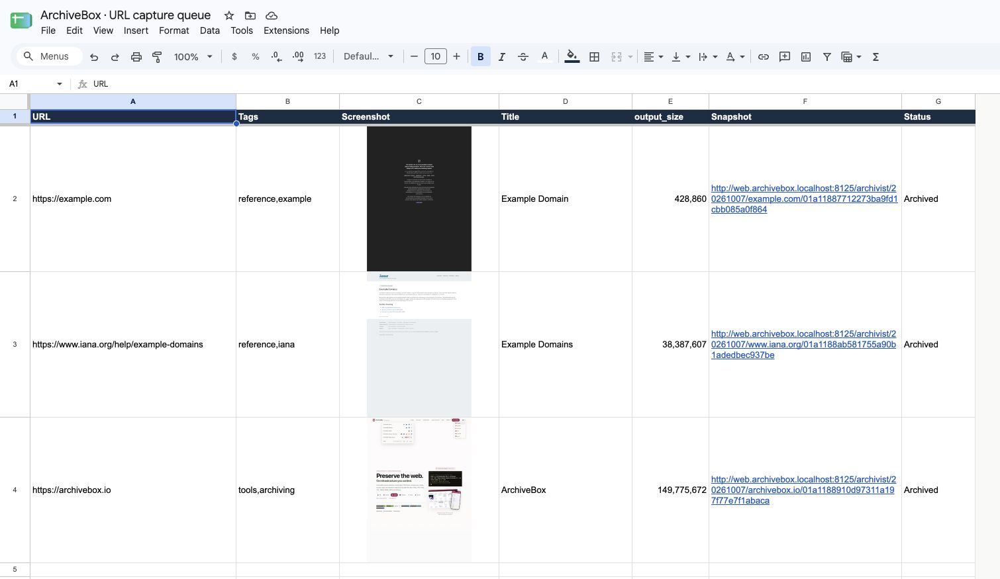

# Archiving URLs from Google Sheets

Save a spreadsheet and the pages linked inside it. Start with a running [ArchiveBox server](Quickstart) with Chrome installed.

*Requires the development build with saved-document discovery in `parse_txt_urls`.*

## 1. Put your links in a sheet

Use ordinary URLs or linked cell text, in any column. This example uses Andrew Wheeler's public [research replication materials](https://docs.google.com/spreadsheets/d/1g8eYhbeu55Z5rLpvRSjdPZVVYYBq5gSb4Isl6vmcAa0/edit).

## 2. Add the sheet URL

Open **Add** in ArchiveBox. Paste the sheet's URL and select **depth = 1**. Keep the default plugins enabled and leave **Same domain only** unchecked.

For a private sheet, select a [Persona with your Google login session](Chromium-Install#setting-up-a-chromium-user-profile).

Click **Create Crawl and Start Archiving**.

## 3. Open the saved pages

Open **Snapshots**. Search for a domain from your sheet and press **Enter**. The discovered URLs appear automatically; open a result once archiving finishes to browse its saved copies.

All URL parsers run, so the crawl can also include links from Google's surrounding UI.

The same steps work with a Google Doc containing links: paste its document URL and select **depth = 1**.

## 4. Optional: write results back to the sheet

Use a sheet you can edit. Add columns beside the original URLs, such as **Snapshot**, **Screenshot**, and **Status**.

### A. Automatic: ask the built-in AI agent

Enable `OPENCODE_ENABLED=True`, restart ArchiveBox, then open **Agent** as an admin and connect your AI provider. Give it the sheet URL, your Persona name, and the columns to fill:

> Update [sheet URL] with the results from crawl [crawl ID]. Use the Google login cookies from my “Research” Persona to edit the sheet in Chrome. Match the original URLs in column A; put each snapshot detail-page link in B, its saved screenshot link in C, and the capture status in D. Only update those result columns. Check the saved outputs before marking a row complete, and leave unavailable screenshots blank.

The Persona's Google account needs editing access. This is an agent task you request after archiving; repeat it for later captures.

### B. Manual setup: webhooks → n8n → Google Sheets

Import the [n8n workflow](https://raw.githubusercontent.com/ArchiveBox/docs/master/examples/google-sheets-n8n.json) to read URLs **and tags** from your sheet, then fill in the results automatically:

**Read sheet → Archive URLs** 
**Completion webhook → Read snapshot → Update matching sheet row**

1. Add headers **URL**, **Tags**, **Screenshot**, **Title**, **output_size**, **Snapshot**, **Status**. Put one literal URL per row and comma-separated tags beside it.
2. [Connect Google Sheets to n8n](https://docs.n8n.io/integrations/builtin/credentials/google/oauth-single-service/). Select your spreadsheet and tab in both Google Sheets nodes. In both HTTP Request nodes, set your ArchiveBox API origin and a Header Auth credential: `X-ArchiveBox-API-Key` = your key from **Admin → API Keys**. In **Prepare sheet columns**, set your web origin and screenshot origin.
3. Give the Webhook node a Header Auth credential with header name `Authorization` and a secret value, such as `Bearer YOUR_RANDOM_SECRET`. In ArchiveBox's **Admin → API Outbound Webhooks**, choose **Snapshots**, signal **Update**, and enter n8n's production webhook URL. Set **Authentication token** to the same full header value; enable **Keep last response**. Save, then publish the n8n workflow.
4. Choose **Import sheet URLs → Execute workflow**. Rows with an empty **Snapshot** cell are archived using the default plugins. Each `sealed` webhook fetches the final title and database `output_size` in bytes, then updates the row matching **URL**. **Screenshot** uses `IMAGE()` to display the actual saved PNG; missing screenshots stay blank.

  

Google must be able to fetch the screenshot URLs without logging in; click **Allow access** if Sheets prompts before loading images. For this local example, a temporary HTTPS endpoint serves only the test captures' PNGs. Use a reachable screenshot origin for your deployment; the **Snapshot** links can still lead to your private ArchiveBox. To use different column names, change the mappings in **Update matching URL row**.

## Other tools

- [Bellingcat Auto Archiver](https://www.bellingcat.com/resources/2022/09/22/preserve-vital-online-content-with-bellingcats-auto-archiver-tool/) — reads URLs from Google Sheets and writes archive status and locations back. [Google Sheets setup](https://auto-archiver.readthedocs.io/en/latest/how_to/02_gsheets_setup.html).
- [Wayback Machine: Save Page Now for Google Sheets](https://archive.org/services/wayback-gsheets/) — submit a sheet of URLs to archive in the Internet Archive.
