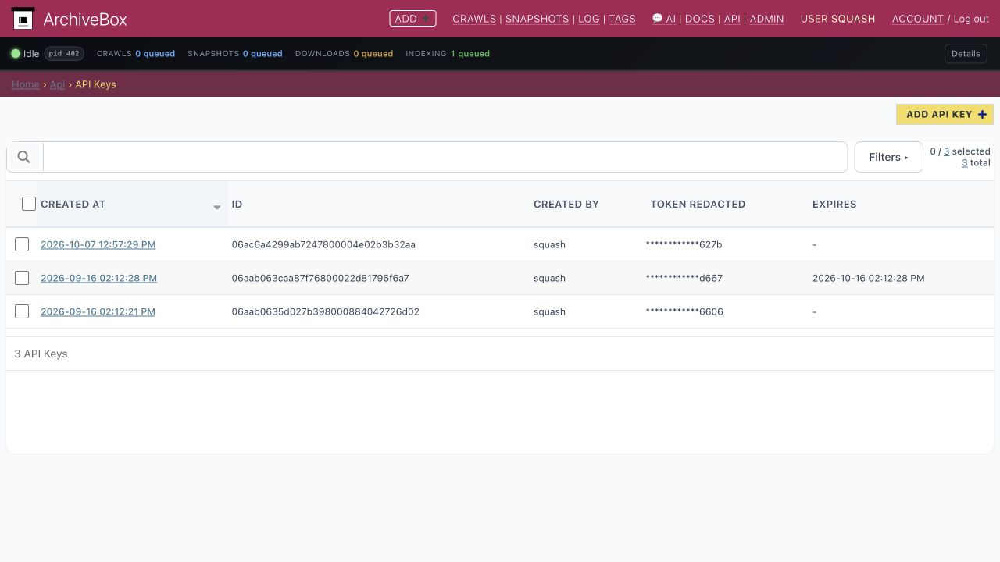
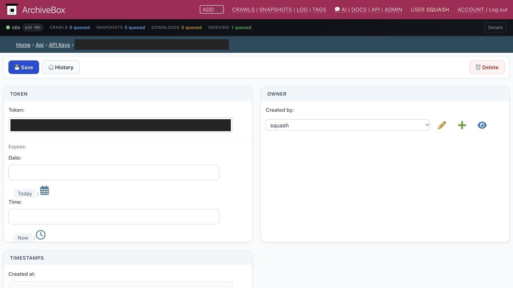
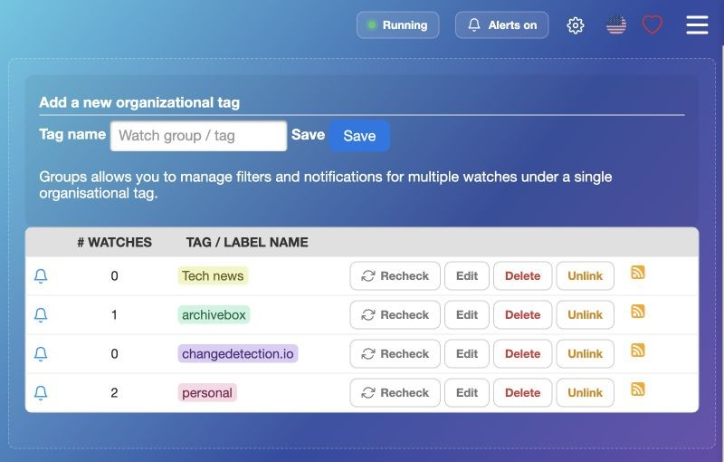
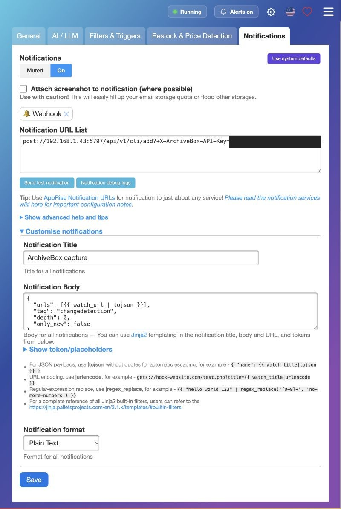
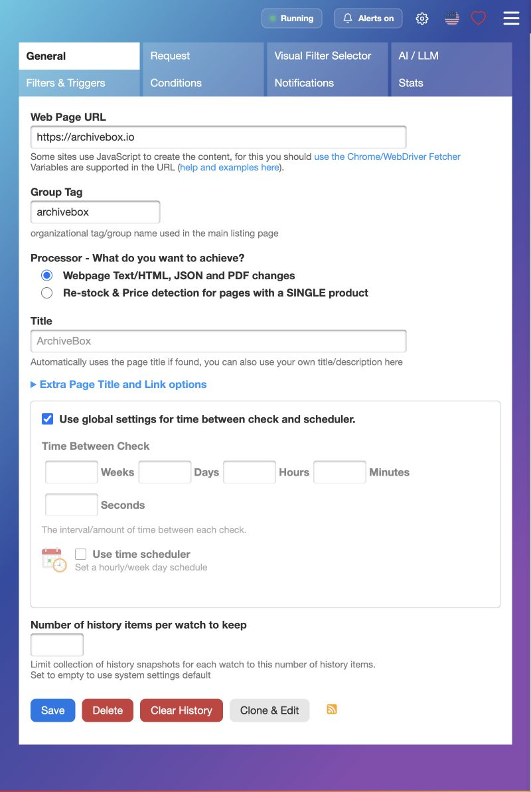
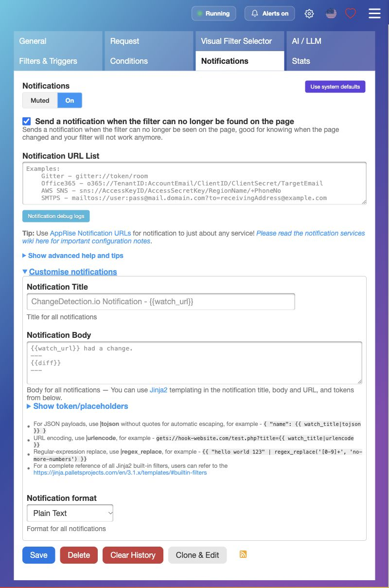
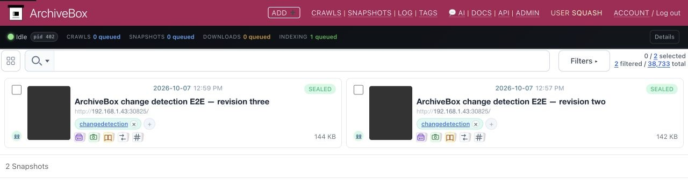

# Archive pages when they change

Automatically save new versions of pages when they change. Start with a running [ArchiveBox server](Quickstart) and [changedetection.io](https://github.com/dgtlmoon/changedetection.io#installation).

## 1. Create an ArchiveBox API key

Open **Admin → API Keys → Add API Key** in ArchiveBox. Choose a superuser under **Created by**, save, and copy the token. Keep it private.





## 2. Allow LAN connections

If ArchiveBox uses a private LAN address, add this environment variable to **changedetection.io**:

```text
ALLOW_IANA_RESTRICTED_ADDRESSES=true
```

Add it through your container manager's environment settings and recreate the container. With Docker Compose, add `ALLOW_IANA_RESTRICTED_ADDRESSES: "true"` under `environment`, then run `docker compose up -d`.

## 3. Create an archiving group

In changedetection.io, open **Watch Groups**, create `archivebox`, then click **Edit**.



Under **Notifications**, turn notifications **On** and set **Notification URL List**:

```text
post://192.168.1.43:5797/api/v1/cli/add?+X-ArchiveBox-API-Key=YOUR_API_KEY
```

Replace the host, port, and `YOUR_API_KEY` with yours. Use an address reachable from the container, not `localhost`. For HTTPS, use `posts://`.

Under **Customise notifications**, set **Title** to `ArchiveBox capture`, **format** to **Plain Text**, and **Body** to:

```jinja
{
  "urls": [{{ watch_url | tojson }}],
  "tag": "changedetection",
  "depth": 0,
  "only_new": false
}
```

Click **Save**.



## 4. Choose the pages to archive

Edit a watch. Under **General → Group Tag**, add `archivebox`, keeping any existing tags.



Under the watch's **Notifications** tab:

- Turn notifications **On**.
- Leave **Notification URL List**, **Title**, and **Body** empty to inherit the group settings.
- Under **Customise notifications**, select **Plain Text**, not **System default**.
- Click **Save**.



## 5. Check your first capture

In the **group's Notifications tab**, click **Send test notification**. This may select a watch outside the group. Find the capture in ArchiveBox under the `changedetection` tag and open its saved HTML or screenshot.



**Troubleshooting:** check changedetection.io's **Notification debug logs**. Captures stuck queued? Check ArchiveBox's background worker. Private pages need a separate [ArchiveBox login session](https://github.com/ArchiveBox/ArchiveBox/wiki/Chromium-Install#setting-up-a-chromium-user-profile).

More: changedetection.io's [notifications](https://github.com/dgtlmoon/changedetection.io/wiki/Notification-configuration-notes#postposts) and [filters](https://github.com/dgtlmoon/changedetection.io/wiki/CSS-Selector-help).

*Tested with changedetection.io 0.60.7 and ArchiveBox 0.9.74rc16.*
